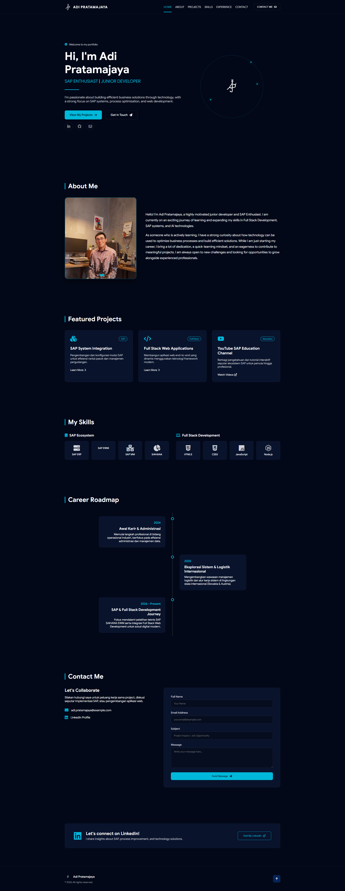

# Adi Pratamajaya Portfolio

A responsive single-page portfolio website for Adi Pratamajaya, presenting his interests in SAP systems, business process optimization, and full-stack web development.

## Website Design



The design uses a dark, technology-focused visual style with teal accents, a fixed navigation bar, responsive content sections, project cards, a career timeline, and a contact form.

## Overview

The website is designed as a personal portfolio and professional introduction. It includes:

- A hero section with a short introduction and calls to action
- About section with an automatic profile image slider
- Featured projects covering SAP, full-stack applications, and SAP education
- Skills grouped into SAP Ecosystem and Full Stack Development
- Career roadmap from 2024 to the present
- Contact section with a project inquiry form
- LinkedIn call-to-action banner and footer navigation

## Features

- Responsive layout for desktop and mobile screens
- Fixed navigation bar with active-section indicator
- Mobile hamburger menu
- Smooth scrolling between sections
- Scroll-triggered reveal animations
- Automatic About-section image rotation every four seconds
- Interactive project-details modal
- Escape-key and backdrop controls for closing the modal
- Animated hero logo and visual hover effects
- Font Awesome icons and Google Sans typography loaded from CDNs

## Project Structure

```text
.
├── index.html              # Main single-page portfolio markup
├── package.json            # Project metadata and npm scripts
├── designWeb.jpg           # Website design preview
├── css/
│   └── style.css           # Layout, theme, responsive styles, and animations
├── js/
│   └── script.js           # Navigation, slider, modal, and scroll interactions
└── image/
    ├── adipratamajaya_logo.png
    ├── adipratamajaya_profile.jpg
    ├── Gemini_Generated_Image_x5oh69x5oh69x5oh.png
    └── newadipratamajaya_logo.png
```

## Getting Started

### Option 1: Open directly

No build step is required. Open `index.html` in a modern web browser.

### Option 2: Run a local server

A local server is recommended for a browser-like development workflow. For example, with Node.js installed:

```bash
npx serve .
```

Then open the local URL displayed in the terminal.

## Development

This is a static HTML, CSS, and JavaScript project. Edit the following files to make changes:

- `index.html` for content and page structure
- `css/style.css` for visual design and responsive behavior
- `js/script.js` for interactive behavior
- `image/` for portfolio images and logos

The project currently has no external npm dependencies and no automated test suite. The existing `npm test` command is the default placeholder from project initialization.

## Current Notes

- Social links, project links, and the LinkedIn button currently use placeholder targets and should be replaced with real URLs.
- The contact form is currently visual only; it does not send messages to a backend or email service.
- The email address shown in the contact section is an example address and should be updated before publishing.
- Font Awesome and Google Fonts require an internet connection when loaded from their CDNs.

## License

The project metadata currently lists the `ISC` license in `package.json`.
